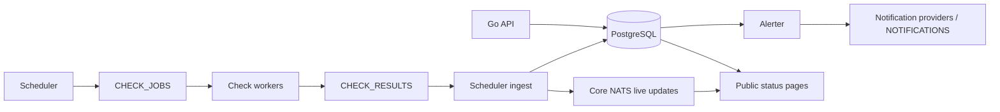

# Architecture

Probara is a Go monorepo with independently deployed API, scheduler, worker,
alerter, and public status-page services. PostgreSQL is the source of truth;
NATS JetStream transports durable work, while core NATS distributes live
updates. The authenticated Next.js application (`web/`) and static product
website (`website/`) are separate applications.

## Service responsibilities

| Component | Responsibilities | Data access |
|---|---|---|
| `api/` | Tenant-scoped monitor CRUD, sessions/OIDC/RBAC, API keys, imports, incidents, maintenance, notification configuration, templates, locations, push and OTLP ingestion | PostgreSQL and NATS |
| `scheduler/` | Claim due monitors, publish check jobs, detect missing passive reports, schedule mesh probes, maintain rollups, retention, and soft-delete purging | PostgreSQL and NATS |
| `scheduler/internal/ingest/` | Persist results idempotently; advance location/quorum and monitor state; update timelines, metrics, and dirty rollup buckets; publish live changes | Runs in the scheduler process; PostgreSQL and NATS |
| `worker/` | Execute registered checkers and publish results; private workers report liveness and answer mesh probes | Check execution requires NATS, not PostgreSQL. Optional notification and AI consumers also use PostgreSQL |
| `alerter/` | Derive group health; evaluate availability, latency anomalies, host metrics, TLS expiry, and mesh alerts; apply routing, escalation, maintenance, and dependency suppression | PostgreSQL, NATS, and synchronous notification providers when configured |
| `status-page/` | Render public pages, incidents, uptime, templates and live updates; manage browser push subscriptions and delivery | PostgreSQL reads and subscription/delivery writes; NATS |
| `web/` | Authenticated operator UI and `/api` proxy, including cookies and SSE streams | Go API |
| `website/` | Statically exported public product website and documentation | No application database |

Worker checkers include HTTP, ping, DNS, TCP, gRPC, SIP, synthetic API/browser,
Redis, PostgreSQL, MongoDB, RabbitMQ, MySQL, and WebSocket checks. `agent`,
`push`, and `group` monitors are passive and are not dispatched as worker checks.

Host monitoring uses **probara-collector**, an OpenTelemetry Collector
distribution defined by the OCB manifest in `collector/`. Collectors send OTLP
metrics to the API at `/api/v1/otlp/v1/metrics`; there is no custom host-agent
implementation in this repository.

## Messaging contracts

The following are defaults; consult `shared/config/config.go` and the deployed
values for overrides.

| Purpose | Transport / stream | Subject |
|---|---|---|
| Scheduled checks | JetStream `CHECK_JOBS` | `check.jobs`, with location-specific subjects |
| Worker results | JetStream `CHECK_RESULTS` | `check.results`, with `.loc.<location-id>` variants |
| Alert events | JetStream `ALERTS` | `alerts.*` |
| Optional asynchronous notification delivery | JetStream `NOTIFICATIONS` | `alerts.dispatch.<plugin-type>` |
| Optional incident AI analysis | JetStream `AI_RCA` | `ai.rca.jobs` |
| Status-page/live monitor updates | Core NATS | `statuspage.updates` |

The scheduler claims due monitors using transactions and `FOR UPDATE SKIP
LOCKED`, allowing multiple scheduler replicas. Result ingestion deduplicates
deliveries and preserves evidence ordering; late checks remain in history
without moving the current state backwards. See [state semantics](state-semantics.md)
for transition, quorum, freshness, and availability rules.

Private-location workers use location-scoped broker credentials and encrypted
monitor configurations. The platform validates location result provenance
before persistence. These workers do not receive the database connection or
the platform encryption key. See [worker authentication](location-worker-auth.md).

## Alert lifecycle and delivery

The alerter evaluates database state periodically. Availability outages have
one open alert per monitor and kind, enforced by a partial unique index.
Routing comes from monitor overrides or workspace defaults; maintenance,
group rollup, and dependency suppression determine which channels may fire.
Escalation delays and reminders are tracked per alert/channel.

Group state is derived from enabled, nondeleted leaf descendants in one
evaluation, including nested groups. No participating leaves means unknown.
An empty group's old availability alert is resolved; group timeline integration
remains a separate limitation documented in the state specification.

Notification claims are serialized in PostgreSQL. Failed recovery delivery
is retried from durable resolved-alert and channel-state records, including
after an alerter restart. Optional worker dispatch uses delayed retries and
an acknowledgement timeout longer than the delivery deadline. Delivery to
external providers is not an exactly-once transaction: a provider can accept
a message before a client timeout or process failure. Receivers should use
idempotency where supported.

## Storage and maintenance

Migrations live in `shared/db/migrations/`. The database stores tenants,
monitors, raw results, per-location state, state intervals, incidents, alert
delivery state, OTLP series/samples, and hourly/daily rollups.

Retention and rollup maintenance hold PostgreSQL session advisory locks on
dedicated connections, releasing the same session when a run ends. Retention
works in bounded batches; expired data remaining after a run keeps cleanup
eligible for subsequent passes. Backlog gauges expose affected tenant counts
and the oldest expired timestamp without scanning every expired row.

Analytics choose raw, rollup, or interval-based calculations according to
window coverage and the existing state semantics. Raw analytics stream
results into accumulators; exact median/P95 calculations retain latency
samples, so their memory still scales with the number of successful checks.
See [correctness notes](correctness-notes.md) for sampled/interval differences.

## Shared code and security boundaries

- `shared/monitorstate`, `shared/analytics`, and `shared/alertrouting` hold
  state, availability, and notification-routing contracts shared by services.
- `shared/queue` and `shared/statusupdates` separate durable work from live
  fan-out. Database persistence must not depend on a core-NATS subscriber.
- `shared/secrets`, `shared/locationauth`, and the notification plugin registry
  handle encrypted configuration and delivery integrations.
- API authorization is tenant-scoped and capability-aware. Read access does
  not grant worker credentials, push tokens, or permission to send saved
  monitor secrets to caller-selected destinations. See [auth and RBAC](auth-and-rbac.md).

## Deployment and verification

Docker Compose provides local PostgreSQL/NATS and optional service containers;
`helm/monitoring-platform` defines Kubernetes deployment assets. Use
`make start-all-local` for local Go services, or `make start-all` for the
Docker-backed stack, with the corresponding stop/restart commands.

Operational endpoints `/healthz`, `/readyz`, and `/metrics` expose process
health, dependency readiness, and Prometheus metrics. Inspect scheduler
retention/rollup progress, consumer retries, worker freshness, and provider
delivery errors when diagnosing missing or delayed monitoring data.

Run `make test` and `make lint` for Go changes. Integration tests require a
working Docker provider for disposable PostgreSQL/NATS instances. For the
operator UI, run `npm test`, `npm run lint`, `npm run typecheck`, and
`npm run build` in `web/`; frontend CI runs these checks. Run the corresponding
lint/typecheck/build checks in `website/` when that application changes.
