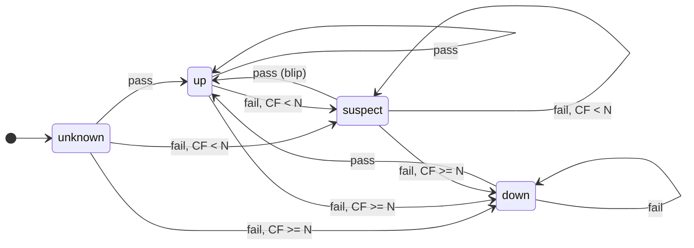
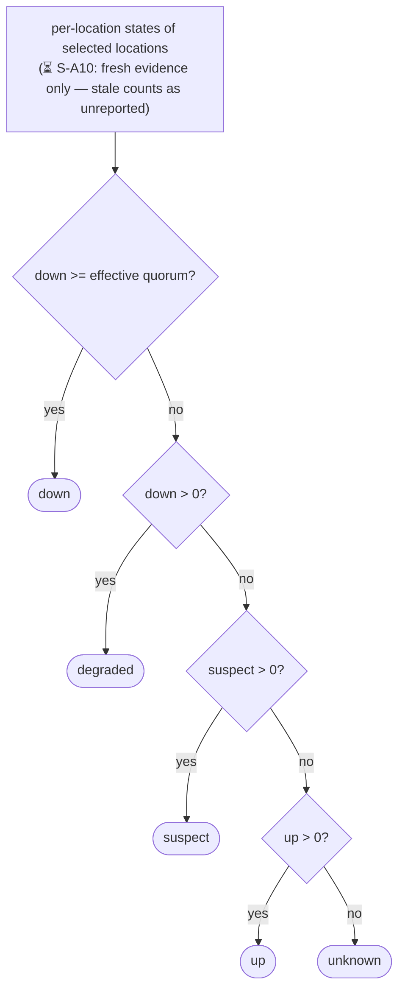
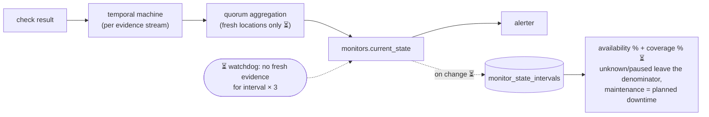

# Monitor State Semantics — Specification

Normative specification for how Probara derives, records, and reports monitor
state. Every rule has a stable ID (`S-XX#`) and a status:

- ✅ **Implemented** — enforced by the cited tests; behavior changes must
  update this file in the same commit.
- 🚧 **Partial** — implemented on some surfaces, violated on others.
- ⏳ **Pending** — target behavior, not yet implemented; the status line names
  the current divergence. Implementation stages refer to the state-semantics
  program plan.

Rule IDs are append-only: never renumber or reuse; deprecate with a note.
Tests cite rule IDs (`shared/monitorstate/spec_test.go`,
`scheduler/internal/ingest/*_integration_test.go`). The analytics/rollup layer
built on top of these semantics is documented in `correctness-notes.md`.

## Model

Monitor status has two orthogonal dimensions:

1. **Observed state** — what evidence says: `up`, `suspect`, `down`,
   `degraded`, `unknown` (`shared/monitorstate/state.go`). Derived by the
   **temporal machine** (`Apply`) per evidence stream, then for
   multi-location monitors by the **spatial rule** (`AggregateLocations`)
   across per-location states.
2. **Administrative status** — operator intent: `enabled` (pause) and
   maintenance windows. Administrative status is never an input to the
   temporal machine; it annotates the timeline and gates dispatch/alerting.

An **evidence stream** is the sequence of check results for one
(monitor, location) pair, or for the monitor itself when location-less.

The **timeline** (⏳) is `monitor_state_intervals`: one row per contiguous
observed-state interval (`state`, `started_at`, `ended_at` NULL while open,
`reason ∈ {result, watchdog_stale, pause, resume, location_change, seed}`),
written in the same transaction as the transition it records. It is the
substrate for time-based availability (S-U rules). Until it exists, the only
transition record is the overwritten `monitors.current_state` +
`last_state_change_at`.

## Diagrams

### Temporal machine (S-T) — per evidence stream

N = `consecutive_failures_threshold` (clamped ≥ 1, default 2); CF = consecutive
failures counting this result. Outage bookkeeping rides the `down` boundary
(S-T6); the machine never emits `unknown` or `degraded` (S-T5). Pending S-F2
adds the absence edge: from any state, a stream with no fresh evidence for
`interval × 3` returns to `unknown`, and the first fresh result re-enters
through the machine.

### Spatial rule (S-A) — a decision function, not a state machine

Recomputed from per-location states after every per-location transition;
location-less monitors skip it (their single stream drives
`monitors.current_state` directly).

Effective quorum = `clamp(location_quorum, 1, selected)` (S-A6); `degraded`
exists only at this level (S-A8).

### Target pipeline (S-U end state)

## S-E — Evidence

| ID | Rule | Status |
|----|------|--------|
| S-E1 | Only `result_source='monitor'` rows are evidence. `platform` rows (job expired before a worker observed the target) are recorded as history and excluded from state, uptime, and rollups. | ✅ `scheduler/internal/ingest/persist.go` routes platform rows to `InsertOnly`; test `TestIngestExpiredJobInsertsWithoutState`. Historical caveat: the one-shot state seed in migration 000044 picked each monitor's latest row without filtering `result_source`, so an install upgrading through it with a platform row as its latest could briefly start `down`; self-heals on the first live result — no corrective migration warranted |
| S-E2 | `status ∈ {failure, error}` is failing evidence; `success` is passing evidence. | ✅ `IsFailureStatus`, `state.go`; test `TestIsFailureStatus` |
| S-E3 | Evidence identity is `(job_id, result_source)`. Redelivery of known evidence is a no-op: recorded nowhere, moves nothing. | ✅ unique index (migration 000060) + duplicate short-circuit in `record.go` / `quorum.go`; test `TestIngestIsIdempotentOnRedelivery` |
| S-E4 | Evidence from a location no longer selected for the monitor is history-only: inserted, but never moves per-location or monitor state. | ✅ `quorum.go` membership guard within the ingest transaction (test `TestQuorumStaleLocationResultKeepsHistoryButNoState`); the S-O1 lock order closes the concurrent-mutation window in which an in-flight ingest could re-upsert a just-removed location's state row (test `TestSetLocationsCannotResurrectRemovedLocationState_Integration`) |
| S-E5 | For a monitor with selected locations, location-less evidence is history-only (the inverse of S-E4). | ✅ `Record` checks location binding under the monitor lock (serialized against `SetLocations` per S-O1) and records history without running the machine; test `TestIngestLocationLessResultForLocationBoundMonitorIsHistoryOnly` |

## S-T — Temporal machine (per evidence stream)

`Apply(current, resultIsFailure, threshold)`, pure, `state.go`.

| ID | Rule | Status |
|----|------|--------|
| S-T1 | Passing evidence ⇒ `up`, consecutive failures reset to 0. Recovery is single-sample (a recovery-confirmation knob is a possible future extension, out of scope here). | ✅ `TestApply`, `TestSpecProperty_ApplyInvariants` |
| S-T2 | Failing evidence increments consecutive failures. At `>= threshold` (clamped to ≥ 1) ⇒ `down`; below ⇒ `suspect`. | ✅ same |
| S-T3 | From `down`, failing evidence stays `down` — no re-confirmation window. | ✅ same |
| S-T4 | From `down`, passing evidence ⇒ `up` immediately. | ✅ same |
| S-T5 | The temporal machine never outputs `unknown` or `degraded`. `unknown` comes only from absence (S-F) or resets; `degraded` only from the spatial rule (S-A). | ✅ `TestSpecProperty_ApplyInvariants` |
| S-T6 | An outage opens exactly when a stream enters `down` and closes exactly when it leaves `down` via passing evidence (`OpenedOutage` / `ClosedOutage`). | ✅ `TestApply`, `TestSpecScenario_LocationlessConfirmation` |

## S-A — Spatial rule (multi-location aggregation)

`AggregateLocations(counts, quorum)`, pure, `state.go`; counts assembled in
`scheduler/internal/ingest/quorum.go`.

| ID | Rule | Status |
|----|------|--------|
| S-A1 | `down` when ≥ effective-quorum contributing locations are down. | ✅ `TestAggregateLocations`, `TestSpecScenario_QuorumConfirmationAndRecovery` |
| S-A2 | `degraded` when at least one but fewer than effective-quorum contributing locations are down. | ✅ same |
| S-A3 | `suspect` when none down and any contributing location is mid-confirmation. | ✅ same |
| S-A4 | `up` when none down or suspect and at least one contributing location is up. | ✅ same |
| S-A5 | `unknown` when no location contributes evidence. Absence is never health: locations without evidence contribute to no count (they also can never trip quorum). | ✅ Fresh-only counts make stale and never-reported locations equivalent (S-A10); test `TestWatchdogReaggregatesStaleLocations` |
| S-A6 | Effective quorum = `clamp(location_quorum, 1, Selected)` when `Selected > 0`. | ✅ `TestAggregateLocations`, `TestSpecProperty_AggregateInvariants` |
| S-A7 | A single-location monitor behaves identically to a location-less one. | ✅ `TestSpecScenario_SingleLocationParity` |
| S-A8 | `degraded` is monitor-level only; per-location state is `unknown/up/suspect/down` (DB check, migration 000064). | ✅ schema constraint |
| S-A9 | Monitor-level `consecutive_failures` = max over per-location values (drives display and the suspect fast-recheck). | ✅ `quorum.go`; test `TestQuorumDegradedThenDownThenRecovery` |
| S-A10 | Only locations with **fresh** evidence (S-F1) contribute to counts. Stale locations are excluded exactly like never-reported ones; a monitor whose contributing set becomes empty is `unknown` (S-A5). | ✅ `monitorstate.LoadFreshLocationCounts` is the single aggregation input, shared by results ingest (`quorum.go`) and the watchdog's re-aggregation pass (stale locations produce no new results, so the watchdog re-derives). Test `TestWatchdogReaggregatesStaleLocations` |

## S-F — Freshness and absence

All pending (Stage 5) except where noted. Precedent: mesh edges already use
read-time staleness at 3 intervals (`api/internal/services/mesh/service.go`,
`staleAfterIntervals`).

| ID | Rule | Status |
|----|------|--------|
| S-F1 | Evidence is fresh for `interval_seconds × 3` (floor 90s) after its **platform receipt time** (server clock at ingest: `monitor_location_state.last_check_at` / `monitors.last_result_at`), then stale. Worker clocks are untrusted for freshness. Per-type grace stays supported where configured (push: `interval + grace_period_seconds`); the agent stale window (previously `2 × interval`, single-shot) folds into the default and now re-fires each window so failures accumulate toward `down`. Agent evidence is the **OTLP export receipt** itself: one accepted export request = one success heartbeat, regardless of how many data points it carried or rejected. | ✅ `monitorstate.FreshnessHorizonSeconds` (`shared/monitorstate/freshness.go`); tested through the watchdog suite. OTLP heartbeat: `api/internal/services/otlp/service.go` |
| S-F2 | A monitor with no fresh evidence transitions to `unknown` (reason `watchdog_stale`). First fresh evidence re-enters through the temporal machine. No data is **never** rendered as healthy. | ✅ `scheduler/internal/scheduler/watchdog.go` (active pass re-checks staleness under the monitor lock); test `TestWatchdogMarksStaleActiveMonitorUnknown` |
| S-F3 | Staleness transitions are ordinary transitions: same per-monitor serialization (S-O1), timeline row, `state_change` event. | ✅ watchdog passes lock, write the interval, and publish through the shared status publisher; interval asserted in `TestWatchdogMarksStaleActiveMonitorUnknown` |
| S-F4 | Exactly one absence detector exists, scheduler-hosted, advisory-locked (`901337403`). It replaces the API-process push/agent stale workers (whose in-process debounce duplicated synthetic failures across API replicas); push/agent synthetic failures now self-debounce via `last_result_at`. | ✅ watchdog heartbeat pass; test `TestWatchdogSynthesizesPushFailure` |
| S-F5 | `unknown` never opens or closes an outage. Alerting on absence (a `no_data` alert kind) is out of scope for this spec — see the notification-trust program. | ✅ by construction: the watchdog writes `unknown` with no outage bookkeeping, and the alerter opens only on `down` / resolves only on `up` (`lifecycle.go` predicates) |

## S-O — Ordering and concurrency

| ID | Rule | Status |
|----|------|--------|
| S-O1 | Every writer of monitor state or per-location state locks the monitor row (`FOR UPDATE`) **first**, before touching membership or state rows. | ✅ Ingest paths: `record.go`, `quorum.go` (`TestQuorumConcurrentResultsNoDeadlock`). Location-set mutations: `SetLocations` locks the monitor row before its membership/state writes, location `Delete` locks all affected monitor rows in id order (tests `TestSetLocationsRespectsIngestLockOrder_Integration`, `TestDeleteRespectsIngestLockOrder_Integration`, racing each mutation against an ingest-shaped transaction) |
| S-O2 | Evidence older than the newest applied evidence for the same stream (by `started_at`) inserts into history but does not move state — late results never move state backwards. | ✅ Per-stream evidence watermarks: `monitors.last_result_started_at` (global stream, `record.go`) and `monitor_location_state.last_result_started_at` (`quorum.go`), both updated only when evidence applies. Tests `TestIngestLateResultIsHistoryOnly`, `TestIngestLateLocationResultIsHistoryOnly` |
| S-O3 | The agent stream's `started_at` is the **platform receipt time**, not the reporter's clock: OTLP heartbeats stamp server `NOW()`, so the agent watermark is monotonic by construction and collector clock skew cannot reorder history or wedge the watermark. Agent-clock timestamps live only in `metric_samples.ts` (chart axes), clamped at ingest to ≤ now+5min. The `SyntheticAbsence` watermark bypass (S-F4) remains for watchdog rows; with both clocks now server-side its hazard window is strictly narrower than under the legacy agent. | ✅ `api/internal/services/otlp/service.go` (`heartbeat`); legacy `/agent/metrics` still carries reporter clocks until its sunset |

## S-P — Pause

Pause is `monitors.enabled = false`; there is no `paused` machine state.

| ID | Rule | Status |
|----|------|--------|
| S-P1 | Pause stops dispatch, absence detection, and alert opening; open availability alerts resolve. | ✅ scheduler due-query filter; `alerter/internal/alerter/lifecycle.go` open/resolve predicates |
| S-P2 | Pausing resets observed state to `unknown` (consecutive failures 0, per-location machinery cleared) and records a `pause` timeline interval; unpausing opens `unknown` (reason `resume`) until first fresh evidence. | ✅ `SetEnabled` (`api/internal/services/monitors/repository.go`), locked per S-O1; the enabled flag no longer rides the dynamic UPDATE. Location-set resets record `location_change` intervals likewise. Test `TestSetEnabledResetsStateAndWritesTimeline_Integration` |
| S-P3 | Paused time is excluded from availability denominators and rendered as paused — never as up, down, or 100%. | 🚧 Zero-check members now render as no-data instead of 100% (S-D1), but paused time is still invisible in denominators (no rows) rather than accounted; the accounting half lands with interval math. Stage 6 |

## S-M — Maintenance

Maintenance windows are interval tables (`maintenance_windows`), never
duplicated into the state timeline; consumers join them at query time via
`shared/maintenance/predicate.go`.

| ID | Rule | Status |
|----|------|--------|
| S-M1 | Checks and state transitions continue during maintenance; maintenance is an annotation, not a machine input. | ✅ scheduler due-query has no maintenance predicate |
| S-M2 | Maintenance suppresses alert opening and dispatch. | 🚧 `lifecycle.go` applies the predicate in the candidate SELECT but the alert INSERT does not re-check it: a window created between the two can still open an alert (bounded by one eval tick, default 30s). Close by re-evaluating the predicate inside the INSERT |
| S-M3 | Downtime overlapping a maintenance window is planned downtime: excluded from unavailability by default. | 🚧 Enforced in the interval engine (down ∩ maintenance leaves numerator and denominator, clamped so overlapping windows cannot over-subtract); sampled fallback and batch surfaces still count maintenance failures as ordinary downtime. Test `TestComputeIntervalAvailability_IntegratesTimeline` |
| S-M4 | Dependency suppression gates notification dispatch only. A downstream availability alert whose monitor has a down upstream dependency (or whose upstream recovered less than the tenant grace ago) sends nothing while the policy (`monitors.dependency_suppression`, else `tenants.dependency_suppression_enabled`) is on; alert opening, resolution, incidents, status pages and availability accounting are unaffected. | ✅ `alertrouting.SuppressedByDependencyPredicate` in `dispatchOpenAlerts`; grace clock is `alerts.root_cause_cleared_at`, stamped by `annotateOpenAlertRootCauses`. Tests `TestDependencySuppression*` (alerter) and `TestAlertReadPathsReportDependencySuppression` (API twin) |

## S-U — Availability accounting

All pending (Stages 3/6). Current sample-count semantics are documented in
`correctness-notes.md`.

| ID | Rule | Status |
|----|------|--------|
| S-U1 | Availability is time-based: integration of the state timeline over the query window, not sample counting. | 🚧 Engine: `shared/analytics/interval_availability.go`, wired into `GetScopeAnalytics` (monitor detail headline + dashboard long-range `OverallUptime`). Batch surfaces (status pages, group analytics) and the 24h/1h stitched dashboard scalars still use sampled math. Test `TestComputeIntervalAvailability_IntegratesTimeline` |
| S-U2 | Denominator = window − `unknown` − paused (− planned downtime per S-M3). **Coverage** = denominator ÷ window, always reported alongside availability. | ✅ In the interval engine (paused time is recorded as `unknown` intervals, so one exclusion covers both); coverage returned as `coverage_pct` wherever the method is `interval`. Same test |
| S-U3 | `degraded` counts as available by default (config knob later); `suspect` (mid-confirmation) likewise. | ✅ interval engine |
| S-U4 | The timeline source of truth is `monitor_state_intervals`, written in the transition's transaction. | 🚧 Written everywhere a monitor-level transition happens (global machine, quorum aggregate, pause/resume, location changes, creation, migration 000082 seed) with exactly one open interval per monitor — except **group monitors**, whose alerter-SQL state derivation records no transitions (excluded from the timeline until unified). Availability math consumes the timeline in Stage 6. Tests `TestIngestWritesStateIntervals` + the S-P2/S-O2 suites |
| S-U5 | Windows predating the timeline cutover use sampled math, labeled `method: "sampled"`; never silently mixed. | ✅ A scope is interval-covered only when EVERY monitor's timeline reaches the window start; otherwise the sampled rate stands in under `method: "sampled"` (group monitors always fall back — no timeline). Test `TestGetScopeAnalytics_LabelsMethod` |

## S-D — Display conventions

| ID | Rule | Status |
|----|------|--------|
| S-D1 | An empty denominator renders as no-data (“—” / grey), never as 0% and never as 100%. | ✅ Analytics summaries carry `has_data` (`shared/analytics`); dashboard `overall_uptime`, group/member uptime, and sparkline buckets are null on no data (`api/internal/services/dashboard`); series buckets pair the value with `has_data`/`total_checks`; status pages keep the −1 sentinel, and a rollup row with zero checks now renders as no-data, not a red 0% day. Tests: `TestAggregateGroups_NoDataIsNotHundredPercent`, `TestResampleTo_PreservesNoDataGaps`, `web/lib/dashboard-view-model.test.ts` (no-data uptime tile) |
| S-D2 | `unknown` is a visible, distinct category on every surface — never folded into up/ok. | 🚧 Status pages render it; dashboard ops summary skips unknown monitors from status counts |

## Conformance

Pure-layer rules are enforced by `shared/monitorstate/spec_test.go` (golden
scenarios + fixed-seed property tests, each citing rule IDs) together with the
pre-existing `state_test.go` / `aggregate_test.go`. Transactional rules
(S-E1, S-E3, S-E4, S-O1) are enforced by the testcontainers suites in
`scheduler/internal/ingest/` plus the lock-order race tests in
`api/internal/services/monitors/` and `api/internal/services/locations/`.
Pending rules gain their enforcing test in the stage that implements them; a
stage is not done while its rules still read ⏳.

## Change discipline

- Behavior changes to anything specified here update this file in the same
  commit (rule status, or a new rule) — same policy as `CLAUDE.md` for docs.
- New aggregation surfaces (groups, mesh, future roll-ups) must cite which
  S-A/S-F rules they satisfy rather than inventing parallel semantics. Known
  pre-existing divergence: group state is derived three more times outside
  this spec (alerter SQL, status-page, API groups service) — unification is
  tracked separately.
